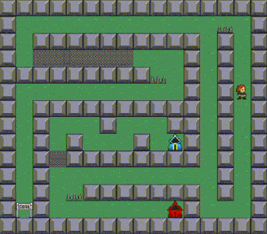

# DGIIM TSI Practice 1

Practice 1 of the Técnicas de los Sistemas Inteligentes course in the Double Degree in Computer Engineering and Mathematics at the University of Granada. This project is based on the GVGAI environment.

The objective of this practice is to guide the agent to the goal using the Dijkstra, A*, RTA* and LRTA* algorithms. In order to pass through the blue walls, the agent needs to collect a blue cape, and a red cape for the red walls.

## How to run it

1. Install OpenJDK and the IDE extension:
    * Method 1: For flatpak version of VSCodium in Linux.
        * Run in the terminal: `flatpak install flathub org.freedesktop.Sdk.Extension.openjdk17` 
        * Run in the terminal: `flatpak override --user --env=FLATPAK_ENABLE_SDK_EXT=openjdk17 com.vscodium.codium`
        * Install `Extension Pack for Java` extension in VSCodium.
2. Open the main folder as a Java project and run the file `./src/tracks/singlePlayer/Test.java`. In this file you can change the game, the level, the algorithm...

## Code developed by the student

The code developed by the student is located in the folder `./src/tracks/singlePlayer/evaluacion`.